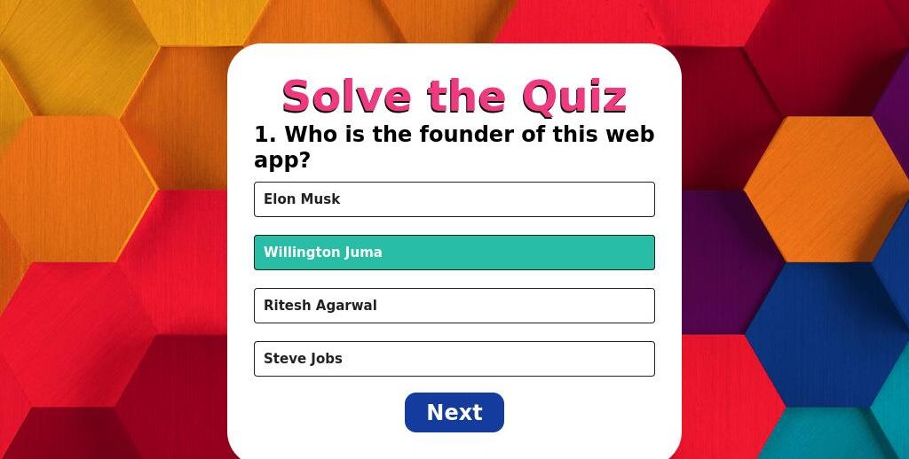

A simple, elegant Quiz Application built by [Your Name], designed to test knowledge across various topics. It features real-time scoring, multiple-choice questions, and smooth UI interactions.
🎯 Features

    

    ⏱️ Timed quizzes

    🧮 Real-time scoring

    📊 Summary results at the end

    🌙 Light/Dark mode (optional)

    📱 Responsive UI (mobile-friendly)

    ## 🖼️ Frontend Preview

This is how the frontend of **quiz app* looks and works:

## 🏗️ Tech Stack

- **Frontend**: HTML5, CSS3
- **JavaScript  required**
- **Hosting**: [Vercel]( https://quizeapp-lyart.vercel.app/)

---

Created with ❤️ by samrato